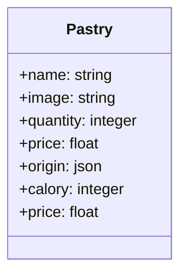

# ORM Symfony Repository DQL

## Projet Pastry

1. :rocket: nous allons découvrir un peu mieux les fixtures, les repositories et  découvrir les services (introduction).

1. :rocket: Dans un deuxième temps nous ferons des révisions sur les relations. 

1. :rocket: Et enfin nous verrons un peu plus de Twig.

## :rocket: Fixtures

1. Installation dans le projet yams ( révision ) SF.
   
1. Créez une base de données yams dans MySQL.

```bash
composer require --dev doctrine/doctrine-fixtures-bundle
# symfony composer req orm-fixtures --dev

# Création d'une Fixture PastryFixtures insertion de données d'exemple
php bin/console make:fixtures PastryFixtures

php bin/console doctrine:fixtures:load
```

## Création de l'entité Pastry


- `Pastry`(name : string, origin : json, calory  :json, price)
  
```txt

+---------+--------------+------+-----+---------+----------------+
| Field   | Type         | Null | Key | Default | Extra          |
+---------+--------------+------+-----+---------+----------------+
| id      | int          | NO   | PRI | NULL    | auto_increment |
| name    | varchar(100) | NO   |     | NULL    |                |
| origin  | json         | YES  |     | NULL    |                |
| calory  | smallint     | YES  |     | NULL    |                |
| price   | double       | YES  |     | NULL    |                |
| image   | varchar(100) | YES  |     | NULL    |                |
| qantity | smallint     | YES  |     | NULL    |                |
+---------+--------------+------+-----+---------+----------------+
```

- 🥟 Schéma des relations diagramme.



## Création des fixtures 

```php

namespace App\DataFixtures;

use App\Entity\Pastry;
use Doctrine\Bundle\FixturesBundle\Fixture;
use Doctrine\Persistence\ObjectManager;

class PastryFixtures extends Fixture
{
    public function load(ObjectManager $manager)
    {
        $pastry = new Pastry(); 
        // TODO ...
        $manager->persist($pastry);
        $manager->flush();
    }
}
```

## Partie 1 : Pastry 🍰

1. Hydratez la table pastry à l'aide de l'ORM avec les données d'exemple ci-dessous.

```php
return [
    [
        "id" => "1",
        "name" => "Fondant supreme",
        "image" => "http://placehold.it/32x32",
        "quantity" => 4,
        "quantityWon" => 0,
        "choice" => false,
        "ratings" => [4.2, 4.5, 3.8],
        "stars" => 4,
        "origin" => [
            "country" => "France",
            "region" => "Île-de-France",
        ],
        "calory" => 300,
        "price" => 5.5
    ],
    [
        "id" => "2",
        "name" => "Cake tout Chocolat",
        "image" => "http://placehold.it/32x32",
        "quantity" => 3,
        "quantityWon" => 0,
        "choice" => false,
        "ratings" => [3.5, 4.0, 4.2],
        "stars" => 3,
        "origin" => [
            "country" => "Belgium",
            "region" => "Flanders",
        ],
        "calory" => 350,
        "price" => 6.0
    ],
    [
        "id" => "3",
        "name" => "Cake Framboise chocolat",
        "image" => "http://placehold.it/32x32",
        "quantity" => 4,
        "quantityWon" => 0,
        "choice" => false,
        "ratings" => [4.0, 3.8, 4.5],
        "stars" => 5,
        "origin" => [
            "country" => "Switzerland",
            "region" => "Vaud",
        ],
        "calory" => 280,
        "price" => 5.0
    ],
    [
        "id" => "4",
        "name" => "Brioche sucrée avec chocolat",
        "image" => "http://placehold.it/32x32",
        "quantityWon" => 0,
        "quantity" => 3,
        "choice" => false,
        "ratings" => [3.2, 3.5, 4.0],
        "stars" => 2,
        "origin" => [
            "country" => "Italy",
            "region" => "Tuscany",
        ],
        "calory" => 320,
        "price" => 4.5
    ],
    [
        "id" => "5",
        "name" => "Cake glacé fondant au chocolat",
        "image" => "http://placehold.it/32x32",
        "quantity" => 2,
        "quantityWon" => 0,
        "choice" => false,
        "ratings" => [3.8, 4.2, 4.5],
        "stars" => 4,
        "origin" => [
            "country" => "Germany",
            "region" => "Bavaria",
        ],
        "calory" => 380,
        "price" => 7.0
    ],
    [
        "id" => "6",
        "name" => "Eclairs au chocolat",
        "image" => "http://placehold.it/32x32",
        "quantity" => 5,
        "quantityWon" => 0,
        "choice" => false,
        "ratings" => [4.5, 4.0, 3.8],
        "stars" => 1,
        "origin" => [
            "country" => "Spain",
            "region" => "Catalonia",
        ],
        "calory" => 250,
        "price" => 6.5
    ],
    [
        "id" => "7",
        "name" => "Tarte poire chocolat",
        "image" => "http://placehold.it/32x32",
        "quantity" => 5,
        "quantityWon" => 0,
        "choice" => false,
        "ratings" => [4.2, 4.5, 3.8],
        "stars" => 3,
        "origin" => [
            "country" => "Netherlands",
            "region" => "North Holland",
        ],
        "calory" => 310,
        "price" => 5.8
    ],
    [
        "id" => "8",
        "name" => "Banana au chocolat",
        "image" => "http://placehold.it/32x32",
        "quantity" => 3,
        "quantityWon" => 0,
        "choice" => false,
        "ratings" => [3.5, 4.0, 4.2],
        "stars" => 5,
        "origin" => [
            "country" => "United Kingdom",
            "region" => "England",
        ],
        "calory" => 290,
        "price" => 5.2
    ],
];
        
```

1. Créez une requête personnalisée (repository) pour faire la somme des prix. 
   
>[!NOTE] Pour chaque entité créée, Doctrine crée un repository (dossier Repositroy), par exemple Pastry et PastryRepository.

🐊 Dans le repository PastryRepository ajoutez la méthode suivante et commentez ce quelle fait concrètement.


```php
// ...
class PastryRepository extends ServiceEntityRepository
{
    // ...
    public function sumAllPrices()
    {
        // p représente quoi ?
        return $this->createQueryBuilder('p')
            ->select('SUM(p.price) as totalSum')
            ->getQuery()
            ->getSingleScalarResult();
    }
}
```

1. Créez le repository findAllOrderedByName, elle ordonne les pâtiserries par ordre croissant.

1. Créez une requête permettant de récupérer les calories de chaque pâtisserie ne dépassant pas une certaine valeur strictement.
   
```php
    $repository->findPastryWithCaloriesGreaterThan($max);
```

## Introduction à la notion de service

1. Créez le service MessageGenerator en TDD (test driven developpement), une simple classe, qui génère un message aléatoire. Une classe avec une méthode qui retourne un message aléatoire. Injectez simplement cette classe dans un contrôleur MessageController et affichez le message dans la page Web en JSON.

:pill: Avant de créez un service, vous pouvez inspecter le container de service à l'aide de la commande suivante :

```bash
php bin/console debug:autowiring
```

> [!NOTE] Les services sont automatiquements injectés dans les méthodes des contrôleurs.

1. Testez maintenant l'ensemble des questions précédentes dans deux services MessageGeneratorService et PastryService.

:rocket: Configuration préalable pour les tests à faire pour les questions précédentes.

:shell:

```bash
# Package de tests pour SF
composer require --dev symfony/test-pack

# Lancer les tests
php bin/phpunit
```

:rocket: Dans le fichier doctrime.yaml il faut faire pour SF ne suffixe pas par défaut le nom de la base de données.

```yaml
when@test:
    doctrine:
        dbal:
            # "TEST_TOKEN" is typically set by ParaTest
            # dbname_suffix: '_test%env(default::TEST_TOKEN)%'
```

1. Commentez le test suivant puis passez à l'implémentation du service lui-même, TDD.
   
```php

namespace App\Tests;

use App\Service\MessageGenerator;
use PHPUnit\Framework\TestCase;

class MessageGeneratorTest extends TestCase
{
    private MessageGenerator $generator;
    private array $messages;
    protected function setUp(): void
    {
        // quelque chose avant
        $this->generator = new MessageGenerator();

        $this->messages =   [
            'These pastries are a delight!',
            'Indulge in the heavenly flavors of these pastries!',
            'You deserve a treat! Try one of these delicious pastries!',
            'Satisfy your sweet tooth with these mouthwatering pastries!',
            'Experience a taste of perfection with these delectable pastries!',
        ];
    }

    public function testMessage(): void
    {
        $message = $this->generator->getHappyMessage();

        $this->assertContains($message, $this->messages);
    }

    protected function tearDown(): void
    {
        parent::tearDown();

        // quelque chose après

    }
}
```

1. :pill: Créez une méthode dans le repository de l'entité Pastry **incrPastryCaloryTotalById** permettant d'augmenter d'un certain pourcentage les calaories d'une pâtisserie. Essayez de tester cette méthode. 

1. Création d'une fonction DQL pour la méthode ROUND de MySQL.
   
1. :pill: (Facultatif ) En SQL que fait la requête suivante ? Pouvez-vous facilement l'implémenter en DQL ou SQL ?
   
```sql
SELECT p.origin FROM pastry as p WHERE JSON_EXTRACT(p.origin, '$.country') = 'France' ;
```