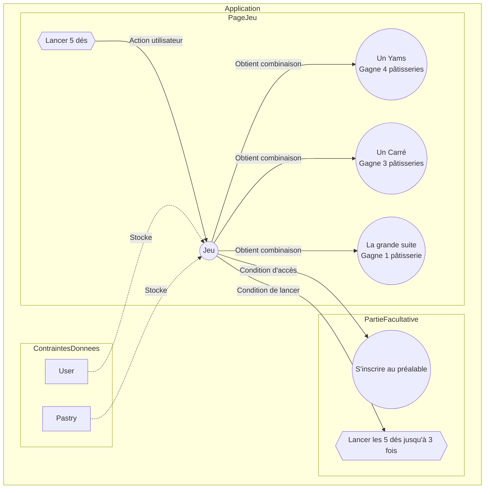

# TP Création d'une application avec Corrections et Ajouts d'Illustrations

Name : 🚀 **gamepastry**

## Introduction
Dans le cadre de ce TP, nous allons créer une application de jeu permettant de gagner des pâtisseries. L'application comportera deux pages : une pour jouer et une autre pour afficher les résultats.

Pour la partie graphique vous libre d'utiliser un framework CSS de votre choix.

## Partie 1 : Page de Jeu

🚀 Sur la page principale, les utilisateurs peuvent lancer cinq dés. S'ils obtiennent une combinaison gagnante, ils remportent des pâtisseries en fonction de la combinaison. Pour cette partie de l'application on pourra rejouer autant de fois que l'on souhaite. Voici les combinaisons gagnantes :

- **Un Yams :** Gagne 4 pâtisseries.
- **Un Carré :** Gagne 3 pâtisseries.
- **La grande suite :** Gagne 1 pâtisserie.

1. Créez le test qui testera le service pour le jeu.

1. Une fois gagné vous serez redirigé vers la page résultat qui affichera la liste des pâtisseries gagnées.

1. Créez une méthode dans le repository PastryRepository permettant d'obtenir de manière aléatoire le nombre de pâtisserie(s) gagnée(s).

1. Créez un filtre Twig affichant les messages suivants en fonction du nombre de pâtisserie(s) gagnée(s).
   
1. Ajoutez un bouton permettant de revenir au jeu en ré-initialisant celui-ci.

## Partie 2 : Facultative

Pour jouer, les utilisateurs doivent s'inscrire au préalable. De plus, chaque joueur peut lancer les cinq dés jusqu'à trois fois de suite.

## 🥟 Contraintes sur les Données

Nous utiliserons deux entités principales : `User` et `Pastry`.

### `User` Entity
- **Champs :**
  - id (int, clé primaire)
  - username (varchar(100), non nul)
  - email (varchar(100), non nul)
  - score (smallint, facultatif)

### `Pastry` Entity
- **Champs :**
  - id (int, clé primaire)
  - name (varchar(100), non nul)
  - origin (json, facultatif)
  - calory (smallint, facultatif)
  - price (double, facultatif)
  - image (varchar(100), facultatif)
  - quantity (smallint, facultatif)

🚀 Ces entités permettront de stocker les informations nécessaires sur les utilisateurs et les pâtisseries dans notre application de jeu. Libre à vous de créer d'autres entités et relations.

## Diagramme du jeu  

